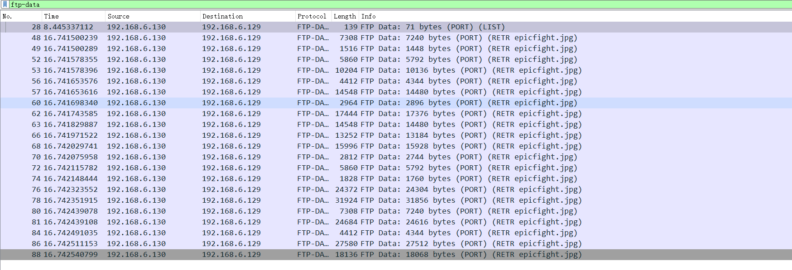

# Dino Trading
## Description
I love trading dinosaurs with my friends! I'm sure nobody can see what we're sending, because otherwise, my dinosaurs might get taken.
## Resources
Wireshark file - download.pcapng  
# Step
At first I thought this is a chal for sFTP or FTPs, but it just a original FTP chal.  
Therefore, after double checking there isn't any other useful information in pcapng file other than the image file in FTP, I focus on that img file.  
1. add a `ftp-data` filter in wireshark
 
2. export it from wireshark  

3. Follow the [Steg checklist](https://stegonline.georgeom.net/checklist)
4. found some hidden info by using `extract -sf epicfight.jpg` in the Step 9 of the checklist.  
5. Try to use base64 decode that info (`d2N0Znthbl8xbWFnZV9pbl9hX3BlZWNhcF9iNjR9`) and got flag