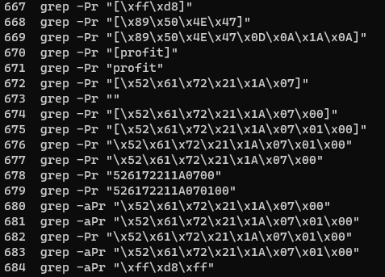
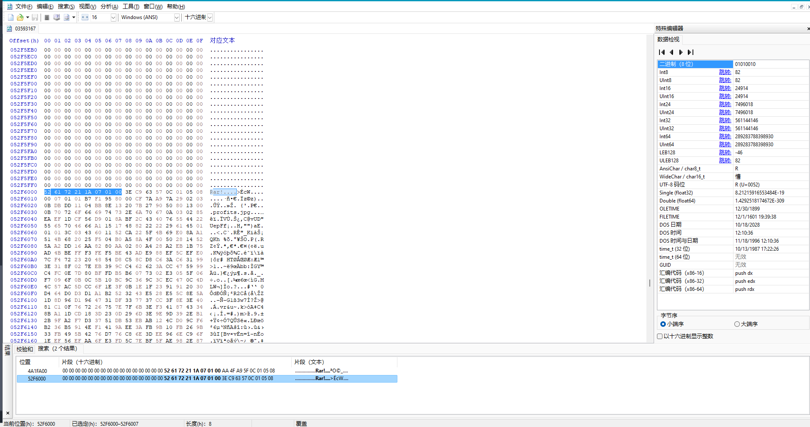

# Employee 427: Locate
## Description
Employee 427 stood up, infuriated, by what has happened to his sensitive files

As Employee 427 began pondering what to do, reality set in

Employee 427 is in big trouble. Employee 427 has a meeting on Monday where the whole Finance department will be awaiting Employee 427's diagram they have been working for so, so long on

Employee 427 thought "If I do not figure out a way to recover this diagram, I am surely fired"

Employee 427 loved their job. Employee 427 does not want to be fired

Employee 427 hopes that you will be able to locate the file that Employee 427 lost. Same triage as Employee 427: Compromised

## Resource
data.zip \[provided by challenge\]
second_rar.rar
output_grep_rar.txt
# Steps
use `grep -aPr <keyword>` to search in `[unallocated space]` (aka trash bin). This challenge has at least two solutions.
## 1st solution
1. use `grep -aPr "profit"`  
2. I notice that there is a suspect GitHub link repeat many times in output: `https://raw.githubusercontent.com/awesomecorp3234243523/private-documents/main/profits.rar`
3. this link is 404, but I can access the repository  
4. Find flag in https://github.com/awesomecorp3234243523/private-documents/blob/main/profits_old.jpg

## 2nd solution
In this chal, I try many different file headers(found in [wiki](https://en.wikipedia.org/wiki/List_of_file_signatures)):  
  
Eventually, I found a suspect rar by grep rar header.
1. by using `grep -aPr "\x52\x61\x72\x21\x1A\x07"`, we can find two rar files in file `03121769/03593167`. (output in `output_grep_rar.txt`)  
2. manually export those rar from bin file  
2.1 open `03121769/03593167` in hex editor (in my case, it is HxD)  
  
2.2 manually find rar data region end  
    - for first one: `4A1FA00` - `4D5F81A`
    - for second one: `52F6000` - `534D952`
2.3 export those:
2.3.1 right click and select `region`
2.3.2 plug those hex addr in
2.3.3 `File -> export region`
3. the first one is WinRaR and the second one is a rar file contained two jpg
4. decompress `second_rar.rar`
5. I have no idea how to combine those two jpeg file into flag image, thanks for **Gent** who writes this script to build flag image:
```python
with open("profits_redacted.jpg", "rb") as fi:
    dat_redacted = bytearray(fi.read())
with open("profits.jpg", "rb") as fi:
    dat = bytearray(fi.read())

for i in range(0xbb8):
    dat[i] = dat_redacted[i]

with open("out.jpg", "wb") as fo:
    fo.write(dat)
```
6. then the flag
