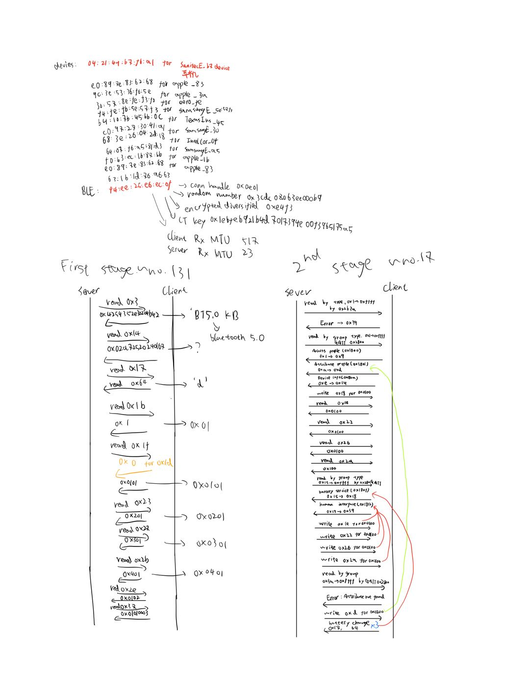
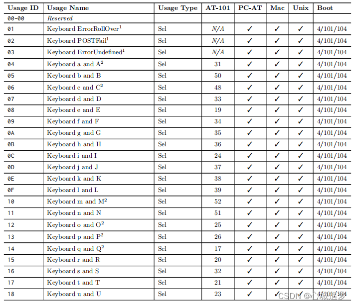

# Challenge
## Description
I found a PCAP of some Bluetooth packets being sent on this guy's computer.  
He's sending some pretty weird stuff, you should take a look.  
Flag format: buckeyectf{}
## resource
A wireShark file: keyboardwarrior.pcap
# Steps
After open the wireShark file, I noticed that it use ATT protocol. 
Thus, I search for gamePad ATT protocol online, but I found nothing.  
Then, I analyze the BLE and ATT protocol (take me a long long time):
  
However, although ATT protocol is really fun, it doesn't have any relationship with this challenge (ToT).  
After analyze the protocol, I notice that only package with id between 177 and 375 contain value. So that, I turn to focus on those packages.  
In those ATT packages, it is an value parameter (8 bytes) which could be the flag.  
And the identify type of the writing handle is HID (Human Interface device), thus I search "HID-ATT" online.  
In the results of search, I click into the [wiki](https://en.wikipedia.org/wiki/Human_interface_device) at first, and it said that the `ATT-HID` protocol is similar to `USB-HID` protocol, thus I search "usb-hid protocol".  
By that searching, I found the protocol definition file: [website](https://www.usb.org/hid) and the [HID Usage Tables 1.3 document](https://www.usb.org/sites/default/files/hut1_3_0.pdf).  
In the protocol document, I check the gamePad page (P83) first, but this protocol document is too complicated for me. So that I go to search other keyword (like "BLE HID protocol", "GATT hid protocol" and so on) and check other document, blog, or stackOverFlow post for this.  
After a searching for a while, I doesn't get any interested information for me :(  
So, I going to search in Chinese (I don't know why, but sometime I can get more information in chinese content).  
After searching keyword like "ble hib 协议", "usb hib 协议解析", "att hib 协议" and so on, I get some interested posts.  
In [first posts](https://blog.csdn.net/weixin_48033504/article/details/124992056), I know the meaning of each bit if the sender is a gamePad:  
First bytes is for mouse. 2nd byte for X cursor movement. 3rd byte for Y cursor movement, and the 4th bytes for wheel movement. But the value of our packages is 8 bytes, thus I assume the sender isn't a gamePad. And I check all protocol type, only size of keyboard package is 8 bytes. Thus, it is safe to say this sender is a keyboard device.  
In [second post](https://blog.csdn.net/qq_34254642/article/details/126672201)
- I get meaning of that 8 bytes value:
The first byte is about ctrl, shift, alt and GUI key.
The 3rd byte is about what other key is pressed.
- And the detail of 3rd byte represent:  
  

Alright, now I get the meaning of those value, it is time for writing solution script.  
I search the "transfer map of HID keyboard" and find this [repository](https://github.com/Danny-Dasilva/Py_Keyboard/blob/master/Py_Keyboard/HID.py) which contain a keyboard map for every keys.  

Then, I find packages in the `.pcap` file which satisfy these condition:
- 3rd bytes of value in first package is "b" (0x05)
- 3rd bytes of value in second package is "u" (0x18)
- 3rd bytes of value in 3rd package is "c" (0x06)
- 3rd bytes of value in last package is "}" (0x30)
- if 3rd bytes of value in any package is 0x0, skip this package

The flag packages id is in `range(255, 322)`.
# Solution
```python
keycode = {
    "A":0x04,
    "B":0x05,
    "C":0x06,
    "D":0x07,
    "E":0x08,
    "F":0x09,
    "G":0x0A,
    "H":0x0B,
    "I":0x0C,
    "J":0x0D,
    "K":0x0E,
    "L":0x0F,
    "M":0x10,
    "N":0x11,
    "O":0x12,
    "P":0x13,
    "Q":0x14,
    "R":0x15,
    "S":0x16,
    "T":0x17,
    "U":0x18,
    "V":0x19,
    "W":0x1A,
    "X":0x1B,
    "Y":0x1C,
    "Z":0x1D,
    "ONE":0x1E,
    "TWO":0x1F,
    "THREE":0x20,
    "FOUR":0x21,
    "FIVE":0x22,
    "SIX":0x23,
    "SEVEN":0x24,
    "EIGHT":0x25,
    "NINE":0x26,
    "ZERO":0x27,
    "ENTER":0x28,
    "RETURN":0x28,
    "ESCAPE":0x29,
    "BACKSPACE":0x2A,
    "TAB":0x2B,
    "SPACEBAR":0x2C,
    "SPACE":0x2C,
    "MINUS":0x2D,
    "EQUALS":0x2E,
    "LEFT_BRACKET":0x2F,
    "RIGHT_BRACKET":0x30,
    "BACKSLASH":0x31,
    "POUND":0x32,
    "SEMICOLON":0x33,
    "QUOTE":0x34,
    "GRAVE_ACCENT":0x35,
    "COMMA":0x36,
    "PERIOD":0x37,
    "FORWARD_SLASH":0x38,
    "CAPS_LOCK":0x39,
    "F1":0x3A,
    "F2":0x3B,
    "F3":0x3C,
    "F4":0x3D,
    "F5":0x3E,
    "F6":0x3F,
    "F7":0x40,
    "F8":0x41,
    "F9":0x42,
    "F10":0x43,
    "F11":0x44,
    "F12":0x45,
    "PRINT_SCREEN":0x46,
    "SCROLL_LOCK":0x47,
    "PAUSE":0x48,
    "INSERT":0x49,
    "HOME":0x4A,
    "PAGE_UP":0x4B,
    "DELETE":0x4C,
    "END":0x4D,
    "PAGE_DOWN":0x4E,

    "RIGHT_ARROW":0x4F,
    "LEFT_ARROW":0x50,
    "DOWN_ARROW":0x51,
    "UP_ARROW":0x52,

    "KEYPAD_NUMLOCK":0x53,
    "KEYPAD_FORWARD_SLASH":0x54,
    "KEYPAD_ASTERISK":0x55,
    "KEYPAD_MINUS":0x56,
    "KEYPAD_PLUS":0x57,
    "KEYPAD_ENTER":0x58,
    "KEYPAD_ONE":0x59,
    "KEYPAD_TWO":0x5A,
    "KEYPAD_THREE":0x5B,
    "KEYPAD_FOUR":0x5C,
    "KEYPAD_FIVE":0x5D,
    "KEYPAD_SIX":0x5E,
    "KEYPAD_SEVEN":0x5F,
    "KEYPAD_EIGHT":0x60,
    "KEYPAD_NINE":0x61,
    "KEYPAD_ZERO":0x62,
    "KEYPAD_PERIOD":0x63,
    "KEYPAD_BACKSLASH":0x64,
    "APPLICATION":0x65,
    "POWER":0x66,
    "KEYPAD_EQUALS":0x67,
    "F13":0x68,
    "F14":0x69,
    "F15":0x6A,
    "F16":0x6B,
    "F17":0x6C,
    "F18":0x6D,
    "F19":0x6E,
    "LEFT_CONTROL":0xE0,
    "CONTROL":0xE0,
    "LEFT_SHIFT":0xE1,
    "SHIFT":0xE1,
    "LEFT_ALT":0xE2,
    "ALT":0xE2,
    "OPTION":0xE2,
    "LEFT_GUI":0xE3,
    "GUI":0xE3,
    "WINDOWS":0xE3,
    "COMMAND":0xE3,
    "RIGHT_CONTROL":0xE4,
    "RIGHT_SHIFT":0xE5,
    "RIGHT_ALT":0xE6,
    "RIGHT_GUI":0xE7
    }

def getCode(i):
    for a in keycode:
        if i == keycode[a]:
            print(a)
            break
# all in lower
getCode(0x5) 
getCode(0x18) 
getCode(0x6) 
getCode(0xe) 
getCode(0x8) 
getCode(0x1c)
getCode(0x8)
getCode(0x6)
getCode(0x17)
getCode(0x9)
getCode(0x2f)
getCode(0x21)
getCode(0x19)
getCode(0x20)
getCode(0x15)
getCode(0x21)
getCode(0xa)
getCode(0x20)
# with shift
getCode(0x2d)
getCode(0x05)
getCode(0x1e)
getCode(0x20)
# with shift
getCode(0x2d)
getCode(0x20)
getCode(0x11)
getCode(0xd)
getCode(0x27)
getCode(0x1c)
getCode(0x20)
getCode(0x15)
getCode(0x30)
```
output:
```
B
U
C
K
E
Y
E
C
T
F
LEFT_BRACKET
FOUR
V
THREE
R
FOUR
G
THREE
MINUS
B
ONE
THREE
MINUS
THREE
N
J
ZERO
Y
THREE
R
RIGHT_BRACKET
```
Then remove all line break, lower all character, replace `MINUS` to `_` (because the shift is also pressed) and replace `LEFT_BRACKET RIGHT_BRACKET` to `{ }`.  