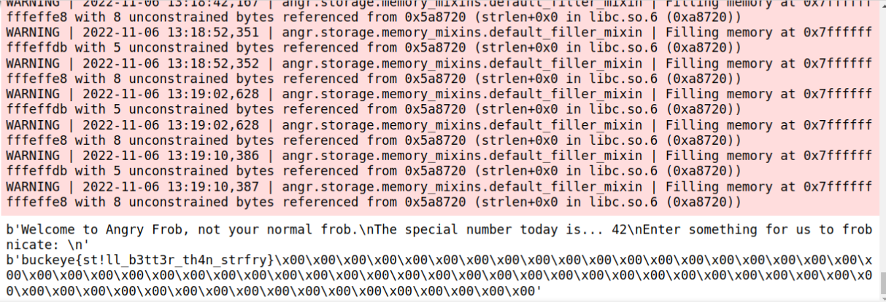

# Challenge
## Description
Fight anger with angr.
## Resource
A executable binary file: Angry
# Steps
## decompile
Use Ghidra to decompile binary.  
The `FUN_001012e6` function seem interest to me.  
decompile code  
```C
undefined8 FUN_001012e6(void)

{
  int iVar1;
  size_t sVar2;
  size_t sVar3;
  long in_FS_OFFSET;
  char local_88 [104];
  long local_20;
  
  local_20 = *(long *)(in_FS_OFFSET + 0x28);
  puts("Welcome to Angry Frob, not your normal frob.");
  printf("The special number today is... %d\n",0x2a);
  puts("Enter something for us to frobnicate: ");
  fgets(local_88,99,stdin);
  sVar2 = strcspn(local_88,"\n");
  local_88[sVar2] = '\0';
  FUN_00101259(local_88,0x2a);
  sVar2 = strlen(local_88);
  sVar3 = strlen(&DAT_00104020);
  if (sVar2 == sVar3) {
    iVar1 = strcmp(local_88,&DAT_00104020);
    if (iVar1 == 0) {
      puts("Congratulations, you found the special string to frob.");
      goto LAB_001013d4;
    }
  }
  puts("Failure, you didn\'t send an interesting string.");
LAB_001013d4:
  if (local_20 != *(long *)(in_FS_OFFSET + 0x28)) {
                    /* WARNING: Subroutine does not return */
    __stack_chk_fail();
  }
  return 0;
}
```
binary code:  
```
                             *************************************************************
                             *                           FUNCTION                          
                             *************************************************************
                             undefined  FUN_001012e6 ()
             undefined         AL:1           <RETURN>
             undefined8        Stack[-0x20]:8 local_20                                XREF[2]:     001012ff (W) , 
                                                                                                   001013d9 (R)   
             undefined1        Stack[-0x88]:1 local_88                                XREF[5]:     00101345 (*) , 
                                                                                                   00101356 (*) , 
                                                                                                   00101375 (*) , 
                                                                                                   00101383 (*) , 
                                                                                                   001013a3 (*)   
             undefined1        Stack[-0x89]:1 local_89                                XREF[3]:     00101305 (W) , 
                                                                                                   00101318 (R) , 
                                                                                                   0010136e (R)   
                             FUN_001012e6                                    XREF[3]:     entry:00101141 (*) , 00102134 , 
                                                                                          00102220 (*)   
        001012e6 f3  0f  1e  fa    ENDBR64
        001012ea 55              PUSH       RBP
        001012eb 48  89  e5       MOV        RBP ,RSP
        001012ee 53              PUSH       RBX
        001012ef 48  81  ec       SUB        RSP ,0x88
                 88  00  00  00
        001012f6 64  48  8b       MOV        RAX ,qword ptr FS:[0x28 ]
                 04  25  28 
                 00  00  00
        001012ff 48  89  45  e8    MOV        qword ptr [RBP  + local_20 ],RAX
        00101303 31  c0           XOR        EAX ,EAX
        00101305 c6  85  7f       MOV        byte ptr [RBP  + local_89 ],0x2a
                 ff  ff  ff  2a
        0010130c 48  8d  3d       LEA        RDI ,[s_Welcome_to_Angry_Frob,_not_your_n_00102  = "Welcome to Angry Frob, not yo
                 f5  0c  00  00
        00101313 e8  98  fd       CALL       <EXTERNAL>::puts                                 int puts(char * __s)
                 ff  ff
        00101318 0f  b6  85       MOVZX      EAX ,byte ptr [RBP  + local_89 ]
                 7f  ff  ff  ff
        0010131f 89  c6           MOV        ESI ,EAX
        00101321 48  8d  3d       LEA        RDI ,[s_The_special_number_today_is..._%_001020  = "The special number today is..
                 10  0d  00  00
        00101328 b8  00  00       MOV        EAX ,0x0
                 00  00
        0010132d e8  ae  fd       CALL       <EXTERNAL>::printf                               int printf(char * __format, ...)
                 ff  ff
        00101332 48  8d  3d       LEA        RDI ,[s_Enter_something_for_us_to_frobni_001020  = "Enter something for us to fro
                 27  0d  00  00
        00101339 e8  72  fd       CALL       <EXTERNAL>::puts                                 int puts(char * __s)
                 ff  ff
        0010133e 48  8b  15       MOV        RDX ,qword ptr [stdin ]
                 0b  2d  00  00
        00101345 48  8d  45  80    LEA        RAX =>local_88 ,[RBP  + -0x80 ]
        00101349 be  63  00       MOV        ESI ,0x63
                 00  00
        0010134e 48  89  c7       MOV        RDI ,RAX
        00101351 e8  aa  fd       CALL       <EXTERNAL>::fgets                                char * fgets(char * __s, int __n
                 ff  ff
        00101356 48  8d  45  80    LEA        RAX =>local_88 ,[RBP  + -0x80 ]
        0010135a 48  8d  35       LEA        RSI ,[DAT_00102087 ]                              = 0Ah
                 26  0d  00  00
        00101361 48  89  c7       MOV        RDI ,RAX
        00101364 e8  87  fd       CALL       <EXTERNAL>::strcspn                              size_t strcspn(char * __s, char 
                 ff  ff
        00101369 c6  44  05       MOV        byte ptr [RBP  + RAX *0x1  + -0x80 ],0x0
                 80  00
        0010136e 0f  b6  95       MOVZX      EDX ,byte ptr [RBP  + local_89 ]
                 7f  ff  ff  ff
        00101375 48  8d  45  80    LEA        RAX =>local_88 ,[RBP  + -0x80 ]
        00101379 89  d6           MOV        ESI ,EDX
        0010137b 48  89  c7       MOV        RDI ,RAX
        0010137e e8  d6  fe       CALL       FUN_00101259                                     undefined FUN_00101259()
                 ff  ff
        00101383 48  8d  45  80    LEA        RAX =>local_88 ,[RBP  + -0x80 ]
        00101387 48  89  c7       MOV        RDI ,RAX
        0010138a e8  31  fd       CALL       <EXTERNAL>::strlen                               size_t strlen(char * __s)
                 ff  ff
        0010138f 48  89  c3       MOV        RBX ,RAX
        00101392 48  8d  3d       LEA        RDI ,[DAT_00104020 ]                              = 89h
                 87  2c  00  00
        00101399 e8  22  fd       CALL       <EXTERNAL>::strlen                               size_t strlen(char * __s)
                 ff  ff
        0010139e 48  39  c3       CMP        RBX ,RAX
        001013a1 75  25           JNZ        LAB_001013c8
        001013a3 48  8d  45  80    LEA        RAX =>local_88 ,[RBP  + -0x80 ]
        001013a7 48  8d  35       LEA        RSI ,[DAT_00104020 ]                              = 89h
                 72  2c  00  00
        001013ae 48  89  c7       MOV        RDI ,RAX
        001013b1 e8  5a  fd       CALL       <EXTERNAL>::strcmp                               int strcmp(char * __s1, char * _
                 ff  ff
        001013b6 85  c0           TEST       EAX ,EAX
        001013b8 75  0e           JNZ        LAB_001013c8
        001013ba 48  8d  3d       LEA        RDI ,[s_Congratulations,_you_found_the_s_001020  = "Congratulations, you found th
                 cf  0c  00  00
        001013c1 e8  ea  fc       CALL       <EXTERNAL>::puts                                 int puts(char * __s)
                 ff  ff
        001013c6 eb  0c           JMP        LAB_001013d4
                             LAB_001013c8                                    XREF[2]:     001013a1 (j) , 001013b8 (j)   
        001013c8 48  8d  3d       LEA        RDI ,[s_Failure,_you_didn't_send_an_inte_001020  = "Failure, you didn't send an i
                 f9  0c  00  00
        001013cf e8  dc  fc       CALL       <EXTERNAL>::puts                                 int puts(char * __s)
                 ff  ff
                             LAB_001013d4                                    XREF[1]:     001013c6 (j)   
        001013d4 b8  00  00       MOV        EAX ,0x0
                 00  00
        001013d9 48  8b  4d  e8    MOV        RCX ,qword ptr [RBP  + local_20 ]
        001013dd 64  48  33       XOR        RCX ,qword ptr FS:[0x28 ]
                 0c  25  28 
                 00  00  00
        001013e6 74  05           JZ         LAB_001013ed
        001013e8 e8  e3  fc       CALL       <EXTERNAL>::__stack_chk_fail                     undefined __stack_chk_fail()
                 ff  ff
                             -- Flow Override: CALL_RETURN (CALL_TERMINATOR)
                             LAB_001013ed                                    XREF[1]:     001013e6 (j)   
        001013ed 48  81  c4       ADD        RSP ,0x88
                 88  00  00  00
        001013f4 5b              POP        RBX
        001013f5 5d              POP        RBP
        001013f6 c3              RET
        001013f7 66              ??         66h    f
        001013f8 0f              ??         0Fh
        001013f9 1f              ??         1Fh
        001013fa 84              ??         84h
        001013fb 00              ??         00h
        001013fc 00              ??         00h
        001013fd 00              ??         00h
        001013fe 00              ??         00h
        001013ff 00              ??         00h

```
## angr
According to the binary code, I will use angr to explore possible input.  
The entry state will be `0x1012e6`, the success state is `0x1013c1` and the fail state is `0x1013cf`.  
Because the pie base address in Ghidra is `0x100000` and the pie base in angr is `0x400000`, I change the `0x1012e6`, `0x1013c1` and `0x1013cf` to `0x4012e6`, `0x4013c1` and `0x4013cf`.  
# Solution
```python
import angr
import sys

path_to_binary = "/home/<usr name>/Desktop/angry"
project = angr.Project(path_to_binary)
initial_state = project.factory.blank_state(addr=0x4012e6)
simulation = project.factory.simgr(initial_state)

simulation.explore(find=0x4013c1, avoid=0x4013cf)

if simulation.found:
    solution_state = simulation.found[0]
    print(solution_state.posix.dumps(1))
    print(solution_state.posix.dumps(0))
else:
    raise Exception('Could not find the solution')
```
Output:  

# Note
PS:  
this angr script gave the flag after running like an hour.  
Constrain the entry state and possible input range can reduce running time.  