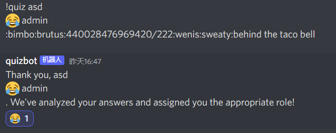

# Challenge
## description
https://discord.gg/q4qtnrKd
## resource
bot python script: bot.py
# Step
In the script, according to `on_raw_reaction_add()`, the bot will add role to member when users add reaction to bot's message.  
# Solution
Send:  
```
!quiz asd
:joy: admin
:bimbo:brutus:440028476969420/222:wenis:sweaty:behind the taco bell
```
to quiz bot, and add :joy: emoji reaction to bot's reply:  
