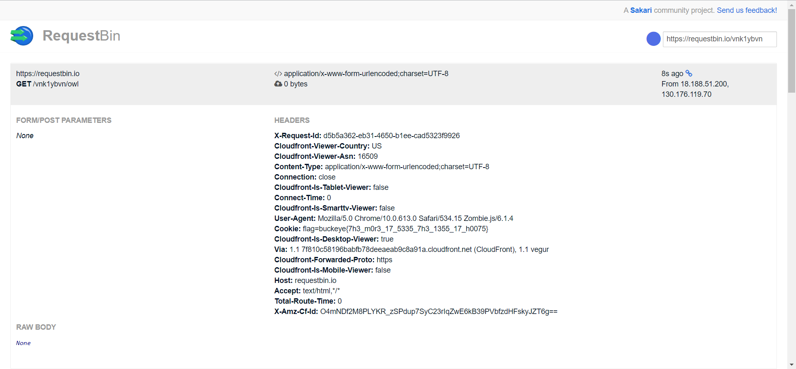

# Challenge
## Description
## Resource
javaScript file: index.js
# Step
In index.js, the owl bot send a request with flag as cookie to our input url if the url contain `owl`.  
```javaScript
        browser.setCookie({
			name: "flag",
			domain: host,
			value: process.env.FLAG
		});

		browser.fetch(url).then(r => {
			return r.text();
		}).then(t => {
			return fly(url, t);
		}).then(m => {
			resolve(m);
		});
```
So that, I need a service that can record all request to a url.  
After searching online and asking other people and mentor, I find `requestBin` which enable us to record all request to a url.
# Solution
Go to [requestBin](https://requestbin.io/) get a random url.  
Send that url plus `owl` to owl bot, like `https://requestbin.io/vnk1ybvn/owl`.  
