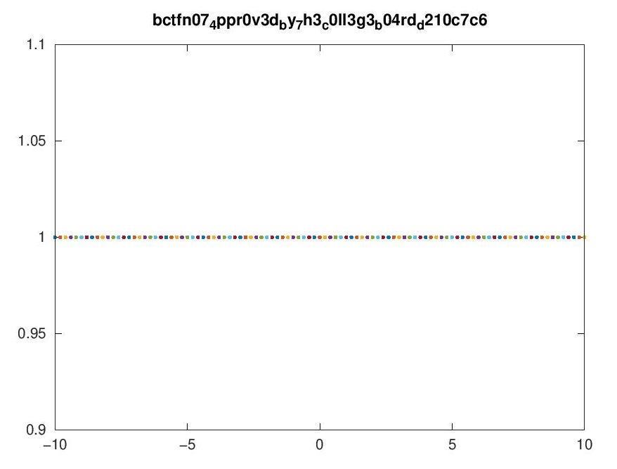

# Ohio Instruments 84
## Description
Locally sourced graphing calculator.

https://ohio-instruments-84.chall.pwnoh.io
## Author
jm8
## Resources
`export.zip` - source code
## Solution
0. By auditing the source code, we can find that program use `octave` to draw the graph.
1. By doing some search on internet, the GNU octave is designed to similar to MATLAB.
2. Therefore, we can directly use `system()` and `fileread()` on the code.
3. Then, we meet our first question: how we make a RCE (remote code execution) payload? Although we can't input new line on the input box, since the code is passed through URL, we can use `%0A` (the new line in URL encoding) to make a RCE.  
e.g. `1)%0Acos(x` will be  
    ```matlab
    x = -10:.2:10; h = figure('visible', 'off'); plot(x, $1)
    cos(x); saveas(h, '${filename}')
    ```  
4. However, by the restriction of regex, we can't use char or string directly on the code. Then, we can simply bypass this restriction by using `dir()` function (which will return the `dir` as matrix).
5. Hence, we can use `fileread(dir()(7).name())` to read the flag. Then is the final question: how can we show the content?
6. As same as program of MATLAB, we can use `title`, `xlabel`, `ylabel` and so on to add some text on our lovely graph.
7. Done!  

Final payload:
```uri
1)%0Atitle(fileread(dir()(7).name()))%0Acos(x
```
and the url `https://ohio-instruments-84.chall.pwnoh.io/1)%0Atitle(fileread(dir()(8).name()))%0Acos(x`.  
Result:
