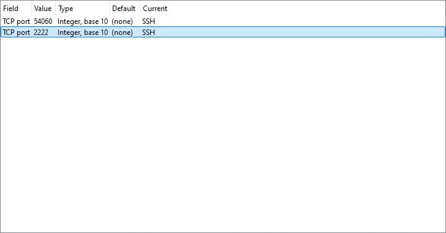
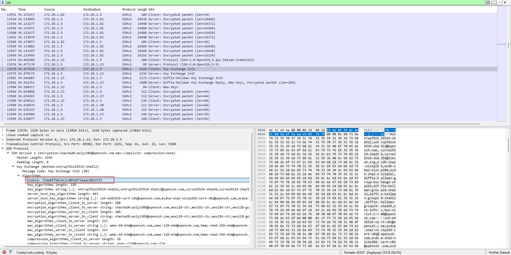

# ja4a4a4do0o0ore SSH!

## Description

A beneficiary has automated many tasks using SSH connections. Unfortunately, during a transition to key-based authentication, the password used by SSH clients was compromised, and they suspect that an attacker infiltrated their local network by interactively connecting to their server.

Find the attacker’s IP address in the captured network trace among all the usual SSH connections.

The flag consists of the SSH connection cookies exchanged between the attacker and the server in the following format: FCSC{cookie_ssh_client-cookie_ssh_server}.

A fixed addressing plan would have been useful, but Christmas is still a few months away…

## Solution

Need to let WireShark to correctly decode it:

right click in WireShark to decode-as and select SSH as current. Then find the last set of packets has cookie of client and server.

So tha flag: `FCSC{f24e0ff9dc4c1c005d5f3aaac4853575-90c7d30853db0f93bc8dad28c7b62b4d}`.
