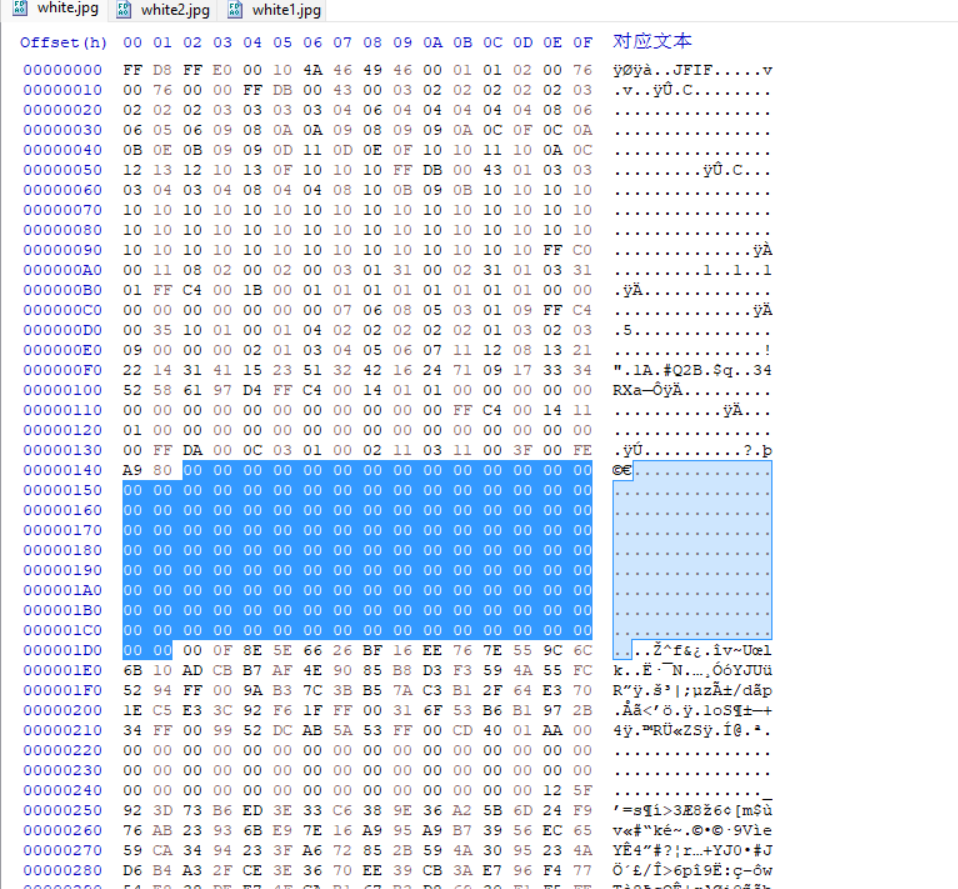

# PAPAPAPA
## Description
Is this image really just white?
## Attachment and official writeup
[https://github.com/google/google-ctf/tree/54f15c51f4b0267288f42274e8064fb2603da2ab/2023/misc-papapapa](https://github.com/google/google-ctf/tree/54f15c51f4b0267288f42274e8064fb2603da2ab/2023/misc-papapapa)
## Solution
1. First of all, since I found nothing in `exiftool` nor `steghide`, I try to find some clue in its binary by `HxD`.
2. Then, I realize that the binary has a bunch of suspicious `0x00` in headers and content.
3. So that I try to delete some `0x00` in the header, and, it is the flag.
