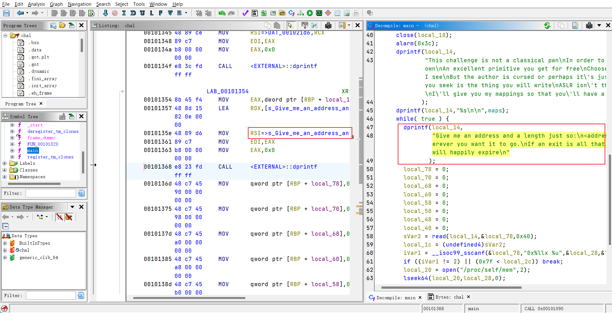

# WRITE-THE-FLAG-WHERE
## Description
This challenge is not a classical pwn  
In order to solve it will take skills of your own  
An excellent primitive you get for free  
Choose an address and I will write what I see  
But the author is cursed or perhaps it's just out of spite  
For the flag that you seek is the thing you will write  
ASLR isn't the challenge so I'll tell you what  
I'll give you my mappings so that you'll have a shot.  
## Attachments and official writeup
[https://github.com/google/google-ctf/tree/54f15c51f4b0267288f42274e8064fb2603da2ab/2023/pwn-write-flag-where](https://github.com/google/google-ctf/tree/54f15c51f4b0267288f42274e8064fb2603da2ab/2023/pwn-write-flag-where)
## Solution
1. find the target string: bc the program will write the flag into specific address and we need to show it up by using its printf

2. find the offset of the const string in binary: 0x21e0
3. payload: its base address + 0x21e0 with 0x48 length
log:
```
== proof-of-work: disabled ==
This challenge is not a classical pwn
In order to solve it will take skills of your own
An excellent primitive you get for free
Choose an address and I will write what I see
But the author is cursed or perhaps it's just out of spite
For the flag that you seek is the thing you will write
ASLR isn't the challenge so I'll tell you what
I'll give you my mappings so that you'll have a shot.
557fb60aa000-557fb60ab000 r--p 00000000 00:11e 810424                    /home/user/chal
557fb60ab000-557fb60ac000 r-xp 00001000 00:11e 810424                    /home/user/chal
557fb60ac000-557fb60ad000 r--p 00002000 00:11e 810424                    /home/user/chal
557fb60ad000-557fb60ae000 r--p 00002000 00:11e 810424                    /home/user/chal
557fb60ae000-557fb60af000 rw-p 00003000 00:11e 810424                    /home/user/chal
557fb60af000-557fb60b0000 rw-p 00000000 00:00 0
7f357bef8000-7f357befb000 rw-p 00000000 00:00 0
7f357befb000-7f357bf23000 r--p 00000000 00:11e 811203                    /usr/lib/x86_64-linux-gnu/libc.so.6
7f357bf23000-7f357c0b8000 r-xp 00028000 00:11e 811203                    /usr/lib/x86_64-linux-gnu/libc.so.6
7f357c0b8000-7f357c110000 r--p 001bd000 00:11e 811203                    /usr/lib/x86_64-linux-gnu/libc.so.6
7f357c110000-7f357c114000 r--p 00214000 00:11e 811203                    /usr/lib/x86_64-linux-gnu/libc.so.6
7f357c114000-7f357c116000 rw-p 00218000 00:11e 811203                    /usr/lib/x86_64-linux-gnu/libc.so.6
7f357c116000-7f357c123000 rw-p 00000000 00:00 0
7f357c125000-7f357c127000 rw-p 00000000 00:00 0
7f357c127000-7f357c129000 r--p 00000000 00:11e 811185                    /usr/lib/x86_64-linux-gnu/ld-linux-x86-64.so.2
7f357c129000-7f357c153000 r-xp 00002000 00:11e 811185                    /usr/lib/x86_64-linux-gnu/ld-linux-x86-64.so.2
7f357c153000-7f357c15e000 r--p 0002c000 00:11e 811185                    /usr/lib/x86_64-linux-gnu/ld-linux-x86-64.so.2
7f357c15f000-7f357c161000 r--p 00037000 00:11e 811185                    /usr/lib/x86_64-linux-gnu/ld-linux-x86-64.so.2
7f357c161000-7f357c163000 rw-p 00039000 00:11e 811185                    /usr/lib/x86_64-linux-gnu/ld-linux-x86-64.so.2
7fffd503b000-7fffd505c000 rw-p 00000000 00:00 0                          [stack]
7fffd509a000-7fffd509e000 r--p 00000000 00:00 0                          [vvar]
7fffd509e000-7fffd50a0000 r-xp 00000000 00:00 0                          [vdso]
ffffffffff600000-ffffffffff601000 --xp 00000000 00:00 0                  [vsyscall]


Give me an address and a length just so:
<address> <length>
And I'll write it wherever you want it to go.
If an exit is all that you desire
Send me nothing and I will happily expire
0x557fb60ac1e0 16
CTF{Y0ur_j0urn3yss and a length just so:
<address> <length>
And I'll write it wherever you want it to go.
If an exit is all that you desire
Send me nothing and I will happily expire
0x557fb60ac1e0 24
CTF{Y0ur_j0urn3y_is_0n1y length just so:
<address> <length>
And I'll write it wherever you want it to go.
If an exit is all that you desire
Send me nothing and I will happily expire
0x557fb60ac1e0 48
CTF{Y0ur_j0urn3y_is_0n1y_ju5t_b39innin9}
```
