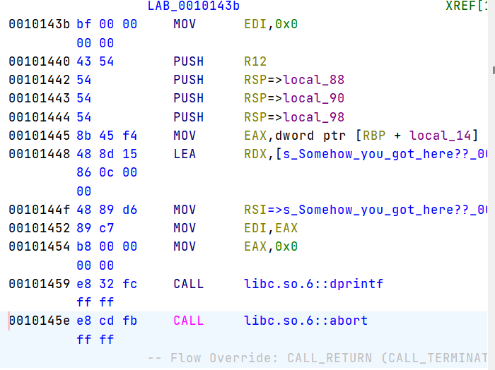

# WRITE-THE-FLAG-WHERE2
## Description
## Attachments and official writeup
[https://github.com/google/google-ctf/tree/54f15c51f4b0267288f42274e8064fb2603da2ab/2023/pwn-write-flag-where2](https://github.com/google/google-ctf/tree/54f15c51f4b0267288f42274e8064fb2603da2ab/2023/pwn-write-flag-where2)
## Solution
1. firstly, by auditing the whole program, I found a suspicious text in `0x102050` and a group of unreachable code from `0x101445` to `0x10145e`
2. Then, I disassemble those codes and found a `print` function after `exit`


3. Therefore, we can write our flag into this string, and overwrite the `exit` function to print it out.  
4. Because the first four bytes of flag is `CTF{` -> `0x43 0x54 0x46 0x7b` -> `push r12` = `43 54`; `push rsp` = `54`, we can use `0x43 0x54` or `0x54` to overwrite the `exit` call instruction in binary.  

5. Then, we should write our flag to the printed string constant.  

Logs:  
```
$ nc wfw2.2023.ctfcompetition.com 1337
== proof-of-work: disabled ==
Was that too easy? Let's make it tough
It's the challenge from before, but I've removed all the fluff
55fc4ecd6000-55fc4ecd7000 r--p 00000000 00:128 813981                    /home/user/chal
55fc4ecd7000-55fc4ecd8000 r-xp 00001000 00:128 813981                    /home/user/chal
55fc4ecd8000-55fc4ecd9000 r--p 00002000 00:128 813981                    /home/user/chal
55fc4ecd9000-55fc4ecda000 r--p 00002000 00:128 813981                    /home/user/chal
55fc4ecda000-55fc4ecdb000 rw-p 00003000 00:128 813981                    /home/user/chal
55fc4ecdb000-55fc4ecdc000 rw-p 00000000 00:00 0
7f9399c6a000-7f9399c6d000 rw-p 00000000 00:00 0
7f9399c6d000-7f9399c95000 r--p 00000000 00:128 814760                    /usr/lib/x86_64-linux-gnu/libc.so.6
7f9399c95000-7f9399e2a000 r-xp 00028000 00:128 814760                    /usr/lib/x86_64-linux-gnu/libc.so.6
7f9399e2a000-7f9399e82000 r--p 001bd000 00:128 814760                    /usr/lib/x86_64-linux-gnu/libc.so.6
7f9399e82000-7f9399e86000 r--p 00214000 00:128 814760                    /usr/lib/x86_64-linux-gnu/libc.so.6
7f9399e86000-7f9399e88000 rw-p 00218000 00:128 814760                    /usr/lib/x86_64-linux-gnu/libc.so.6
7f9399e88000-7f9399e95000 rw-p 00000000 00:00 0
7f9399e97000-7f9399e99000 rw-p 00000000 00:00 0
7f9399e99000-7f9399e9b000 r--p 00000000 00:128 814742                    /usr/lib/x86_64-linux-gnu/ld-linux-x86-64.so.2
7f9399e9b000-7f9399ec5000 r-xp 00002000 00:128 814742                    /usr/lib/x86_64-linux-gnu/ld-linux-x86-64.so.2
7f9399ec5000-7f9399ed0000 r--p 0002c000 00:128 814742                    /usr/lib/x86_64-linux-gnu/ld-linux-x86-64.so.2
7f9399ed1000-7f9399ed3000 r--p 00037000 00:128 814742                    /usr/lib/x86_64-linux-gnu/ld-linux-x86-64.so.2
7f9399ed3000-7f9399ed5000 rw-p 00039000 00:128 814742                    /usr/lib/x86_64-linux-gnu/ld-linux-x86-64.so.2
7fff1511b000-7fff1513c000 rw-p 00000000 00:00 0                          [stack]
7fff15168000-7fff1516c000 r--p 00000000 00:00 0                          [vvar]
7fff1516c000-7fff1516e000 r-xp 00000000 00:00 0                          [vdso]
ffffffffff600000-ffffffffff601000 --xp 00000000 00:00 0                  [vsyscall]


0x55fc4ecd80d5 64
0x55fc4ecd7443 2
0x55fc4ecd7442 2
0x55fc4ecd7441 2
0x55fc4ecd7440 2
x
CTF{impr355iv3_6ut_can_y0u_s01v3_cha113ng3_3?}
```