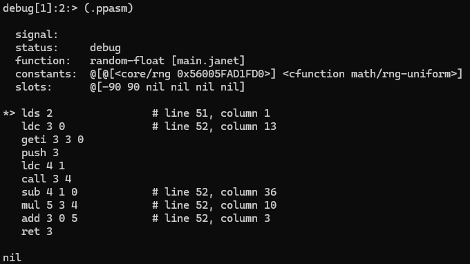

# geoguesser
## Description
I thought geoguesser was too easy, so I made it harder.  

Usage: janet -i program.jimage  

nc geoguesser.chal.uiuc.tf 1337  

Author: richard  
## Attachments
janet - janet runtime  
program.jimage - janet close-source image  
## Solution
Janet is a functional and imperative programming language. Here is my reference documentation in [janet.guide](https://janet.guide/all) and [janet-lang/doc](https://janet-lang.org/doc,./s/index.html).  
By reading those documentations, I found out that I can:
1. import jimage as a module: `(import ./program)`
2. read its metadata by `(load-image (slurp "./program.jimage"))`, and output is:
```
@{compare-coord 
@{:doc "(compare-coord a b tolerance)\n\n" :source-map ("main.janet" 32 1) :value <function compare-coord>} compare-float 
@{:doc "(compare-float a b tolerance)\n\n" :source-map ("main.janet" 29 1) :value <function compare-float>} coordinate-peg 
@{:source-map ("main.janet" 8 1) :value { :float (number (some (+ :d (set ".-+")))) :main (* :ss :float :sep :float :ss) :sep (* :ss "," :ss) :ss (any :s)}} get-guess 
@{:doc "(get-guess)\n\n" :source-map ("main.janet" 21 1) :value <function get-guess>} guessing-game 
@{:doc "(guessing-game answer)\n\n" :source-map ("main.janet" 36 1) :value <function guessing-game>} init-rng 
@{:doc "(init-rng)\n\n" :source-map ("main.janet" 5 1) :value <function init-rng>} main 
@{:doc "(main &)\n\n" :source-map ("main.janet" 54 1) :value <function main>} parse-coord 
@{:doc "(parse-coord s)\n\n" :source-map ("main.janet" 15 1) :value <function parse-coord>} precision 
@{:source-map ("main.janet" 1 1) :value 0.0001} print-flag 
@{:doc "(print-flag)\n\n" :source-map ("main.janet" 46 1) :value <function print-flag>} random-float 
@{:doc "(random-float min max)\n\n" :source-map ("main.janet" 51 1) :value <function random-float>} rng 
@{:ref 
@[nil] :source-map ("main.janet" 3 1)} :current-file "main.janet" :macro-lints 
@[] :source "main.janet"}
```
3. add breakpoints by `(debug/break "__FILE__" __LINE__ __ROW__)`
4. Therefore, according to the metadata, I wrote a helper program(`janet -d program.janet`) to debug the program(`compare-float`, `print-flag` and `random-float`):  
program.janet  
```
(import ./program)
(defn main
 [&]
(debug/break "main.janet" 32 1)
(debug/break "main.janet" 46 1)
(debug/break "main.janet" 51 1)
(program/main)
)
```
5. After the breakpoint triggered, by using `(.ppasm)` and `(.next)`, I can see the assembly code and slots(the stack) and continue until next breakpoint.

6. Then, I realized that this is a kind of guessing game, so I wrote a helper program and start it with `nc geoguesser.chal.uiuc.tf 1337` to guess the random floats:
test.janet
```
(import ./program)

(defn x
[]
    (program/init-rng)
    (print (program/random-float -90 90))
    (print (program/random-float -180 180))
)
(defn main
 [&] 
    (x)
    (ev/sleep 1)
    (x)
    (ev/sleep 1)
    (x)
)
```
7. I break into `random-float` to find out its arguments.
8. The flag:
```
== proof-of-work: disabled ==
Welcome to geoguesser!
Where am I? 20.7282,-44.4430
Nope. You have 4 guesses left.
Where am I? 38.7377,-65.4375
You win!
The flag is: uiuctf{i_se3_y0uv3_f0und_7h3_t1m3_t0_r3v_th15_b333b674c1365966}
```